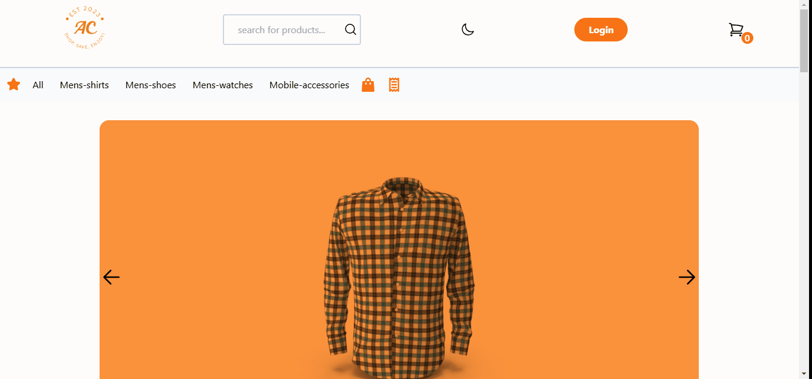

# Typescript E-commerce store app

## Description

A mock e-commerce store built with Vite, React and Typescript, allowing users to browse products through a search feature, image gallery and filtering via categories bar. User can add products to a cart or a wishlist, purchase these products and view order history. The app makes use of client side routing with react router and implements user authentication via firebase creating a smooth user experience. Ideal for small businesses or personal use.

## Features

- Filtering products with a search feature and categories bar.
- React Context is used as a global state manager to access data and methods where needed in the component tree.
- Browse products, add products to cart/wishlist, checkout items and view past orders.
- Provides robust user authentication using firebase SDK.
- Fully functioning image gallery to cycle through products.

## Demo

## Tech Stack Used

- **Front End**: React, Typescript, Tailwind, React-Router, Firebase (authentication)

## Installation

### Prerequisites

- Ensure you have the latest versions of Node.js and npm; check with `node -v` and `npm -v`.

### Instructions:

1. Clone repo:

      `git clone https://github.com/ecommerce-typescript-store-github-url.git`;

2. Navigate to directory:

      `cd typescript-ecommerce-app`

3. Install dependencies:

      `npm install`

4. Run client development server:

      `npm run dev`

The app will open at http://localhost:5173 in your web browser.

## Environment Variables

To successfully run this project, create a '.env' file in the root directory and add these variables to that file from your firebase auth setup:

VITE_FIREBASE_APIKEY="your_api_key"
VITE_FIREBASE_AUTH_DOMAIN="your_auth_domain"
VITE_FIREBASE_PROJECT_ID="your_project_id"
VITE_FIREBASE_STORAGE_BUCKET="your_storage_bucket"
VITE_FIREBASE_MESSAGING_SENDER_ID="your_messaging_sender_id"
VITE_FIREBASE_APP_ID="your_app_id"

## Takeaways

- Understood and implemented React Context as a global state manager.
- Integrated typescript for robust type safety at compile time.
- Optimized navigation speed by implementing client side routing with React Router.
- In testing environment, successfully mocked functions using vitest.
- Identified appropriate use cases for state variables or refs.
- Refactored component logic where appropriate using custom hooks, helper functions and reusable components.

## Acknowledgments

- Firebase
- React Router
- Tailwind CSS
- Dummy JSON API